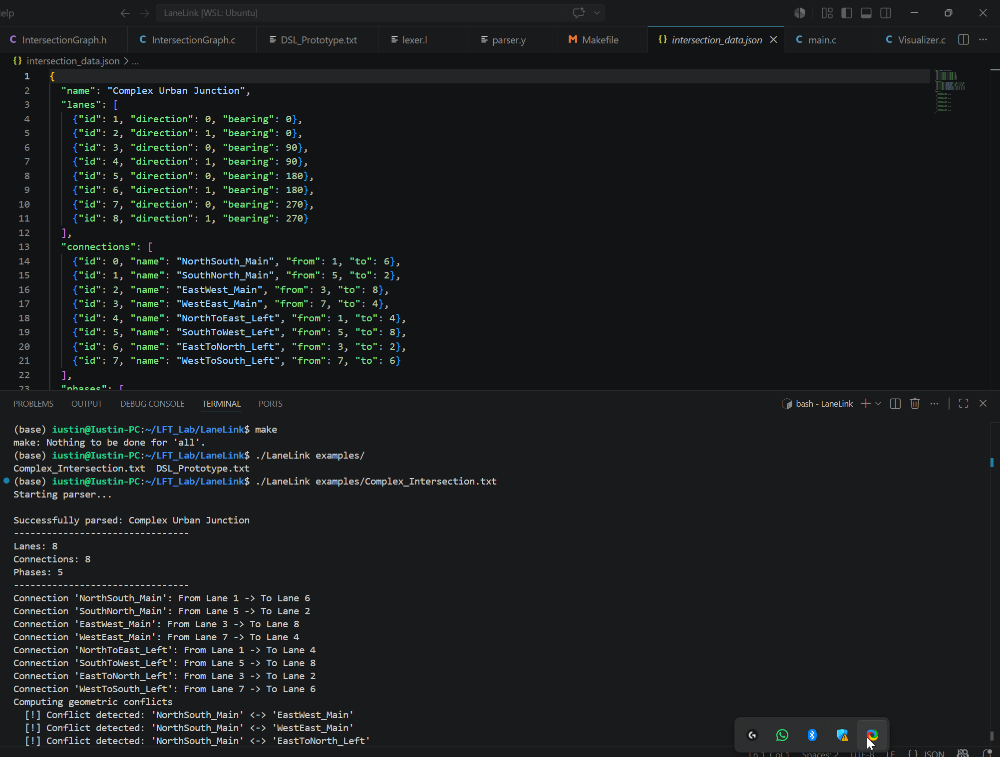
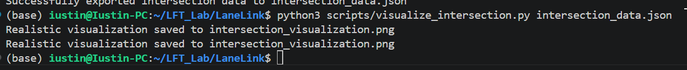
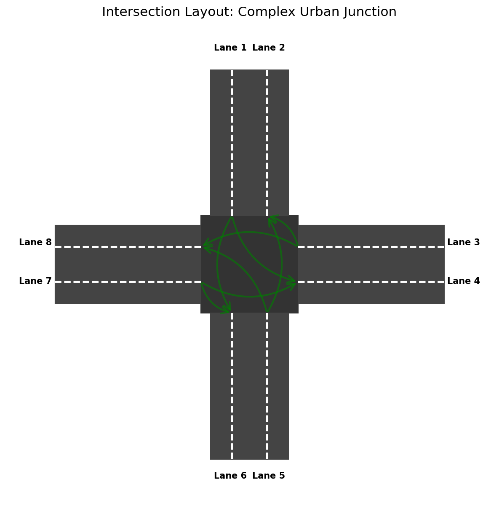

# LaneLink
##### Author: Stolniceanu Iustin-Pavel
LaneLink is a Domain-Specific Language (DSL) designed to describe traffic intersection layouts, signal connections, and timing phases. It serves as a pedagogical example for building a compiler front-end using **Lex (Flex)** and **Yacc (Bison)**.

## Features

- **Geometric Description**: Define lanes with IDs, directions (INCOMING/OUTGOING), and bearings (0-359 degrees).
- **Connectivity**: Map traffic flow between lanes with named connections.
- **Signal Phases**: Group connections into signal phases with specific durations.
- **Conflict Detection**: Automatically calculates geometric conflicts between crossing traffic paths.
- **Visualization**: Generates a JSON representation that can be visualized using a provided Python script.

## Project Structure

```text
.
├── src/
│   ├── lexer.l             # Lexical analyzer (Flex)
│   ├── parser.y            # Syntax analyzer (Bison/Yacc)
│   ├── IntersectionGraph.c # Core logic & Data structures
│   └── main.c              # Application entry point
├── include/
│   └── IntersectionGraph.h # Header definitions
├── examples/
│   ├── DSL_Prototype.txt   # Simple example
│   └── Complex_Intersection.txt # Advanced example
├── scripts/
│   └── visualize_intersection.py # Matplotlib-based visualizer
└── Makefile                # Build system
```

## Prerequisites

To build and run LaneLink, you need:
- `gcc`
- `lex`
- `yacc`
- `python3` (for visualization)
  - `pip install matplotlib numpy` 

## Build Instructions

Compile the project using the provided `Makefile`:

```bash
make
```

This will generate the `LaneLink` executable.

## Usage

### 1. Parse a DSL file
Run the parser on an input file to generate the intersection data and compute conflicts:

```bash
./LaneLink examples/DSL_Prototype.txt
```

This will output `intersection_data.json`.

### 2. Visualize the result
Use the Python script to generate a PNG visualization of the intersection:

```bash
python3 scripts/visualize_intersection.py intersection_data.json
```

The result will be saved as `intersection_visualization.png`.
Example of an intersection generated by the program and vizualized by the script:

## DSL Syntax

An intersection is defined within an `intersection` block:

```traffic
intersection "My Crossroads" {
    // lane <ID> <DIRECTION> <BEARING>;
    lane 1 INCOMING 0;
    lane 2 OUTGOING 180;

    // connect <FROM_ID> -> <TO_ID> as "ConnectionName";
    connect 1 -> 2 as "NorthToSouth";

    // phase { "ConnectionName1", ... } duration <MS>;
    phase { "NorthToSouth" } duration 5000;
}
```

- **Bearings**: 0 is North, 90 is East, 180 is South, 270 is West.
- **Directions**: `INCOMING` for traffic entering the intersection, `OUTGOING` for traffic leaving it.
